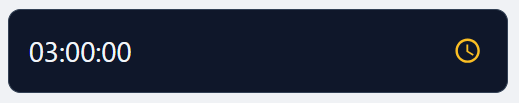
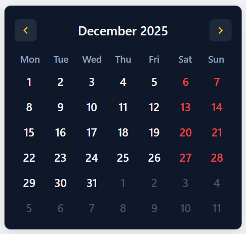
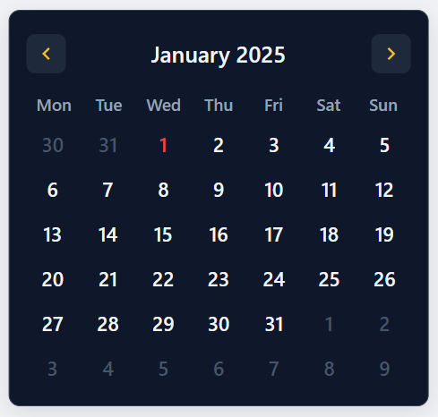
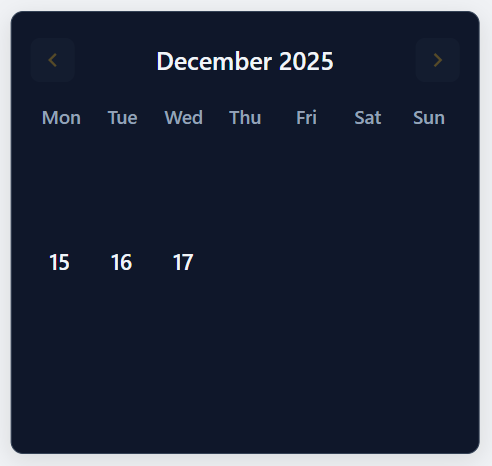
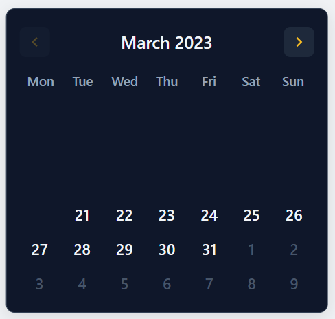
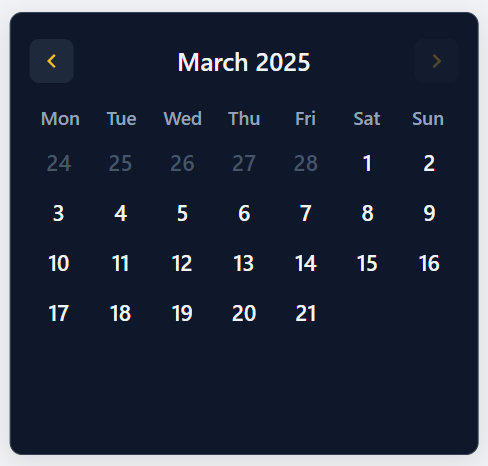

<div align="center">
  <p>
    <a href="./README.tr.md">🇹🇷 Türkçe Dokümantasyon için Tıklayın</a>
  </p>
</div>

# ⭐ TUNCXYS DATEPICKER

* **Tuncxys DatePicker** is a lightweight, independent (Vanilla JS), and fully customizable date and time picker component developed for modern web projects.

* With its user-friendly interface, smart validation systems, and extended theme options, it takes date inputs on your website to the next level.

> **Why Tuncxys DatePicker?**
Most datepickers are either heavy, dependency-bound, or painful to customize. Tuncxys DatePicker aims to provide a lightweight, predictable, and developer-friendly experience.

## 🧬 FEATURES

* 🚫 **No Dependencies:** Does not require jQuery or any other library. Works with its own calendar algorithm.

* 🌍 **Multi-language Support:** Tuncxys DatePicker is coded with 20 language options to appeal to everyone. New languages can be added if needed.

* 🎨 **Advanced Theme System:** In addition to being modern, it has built-in `default`, `dark`, and `custom` theme options and is fully customizable.

* 🎚️ **Responsive Structure & Smart Positioning:** Using next-generation algorithms, it resizes itself and adjusts popup positions without breaking internal elements.

* 🛡️ **Smart Validation & Masking:** With a guiding restriction algorithm, it eliminates logical errors and makes life easier for both developers and users.

## 👨‍💻 INSTALLATION

**1. Include Files in Your Project**

* **OPTION A: CLASSIC METHOD (Browser / UMD)**
    
    *!! Use this method if you are working with standard HTML/CSS/JS.*

    Download the `tuncxys-datepicker.css` and `tuncxys-datepicker.umd.js` files from the `dist` folder in the root directory and add them to your project folder.

    Then add the `tuncxys-datepicker.css` and `tuncxys-datepicker.umd.js` files to your HTML page.

   ```html
   <link rel="stylesheet" href="path/to/tuncxys-datepicker.css">
   <script src="path/to/tuncxys-datepicker.umd.js"></script>
   ```

* **OPTION B: MODERN METHOD (Next Gen / ES Modules)**
    
    *!! Use this method if you are using tools like Vite, Webpack, or a modern module system.*

    **`METHOD 1: MANUAL IMPORT`**

    Download the `tuncxys-datepicker.css` and `tuncxys-datepicker.es.js` files from the `dist` folder in the root directory and add them to your project folder.

    Then add the following lines to your JavaScript codes.

   ```javascript
   import 'path/to/tuncxys-datepicker.css';
   import TuncxysDatePicker from 'path/to/tuncxys-datepicker.es.js';
   ```

   **`METHOD 2: NPM INSTALL`**

    Run the command `npm install tuncxys-datepicker` or `npm install github:Tuncxy/tuncxys-datepicker` in your terminal.

    Then add the following lines to your JavaScript codes.

   ```javascript
   import 'tuncxys-datepicker/css';
   import TuncxysDatePicker from 'tuncxys-datepicker';
   ```

**2. Create the Datepicker**

Create a container element in your HTML file where the datepicker will be placed.

```HTML
<div id="my-datepicker"></div>
```

Initialize the component in JavaScript.

```javascript
new TuncxysDatePicker('#my-datepicker', {
    lang: 'en',
    theme: 'dark'
});
```

**3. Customize the Settings as You Like (Optional)**

```javascript
new TuncxysDatePicker('#my-datepicker', {
    lang: 'tr',
    theme: 'default'
});
```

or

```javascript
new TuncxysDatePicker('#my-datepicker', myDatePickerOptions);

const myDatePickerOptions = {
    lang: 'tr',
    theme: 'default',
    enableDate: false
}
```

## ⚙️ DETAILED CONFIGURATION (SETTINGS)

> **Note:** You do not need to use all settings. Most projects work perfectly with just `lang` and `theme`.

### 🔨 BASIC SETTINGS

* **`lang` >** Used to change the language.

  **USAGE:** `lang: 'en'`    **DEFAULT:** `'en'`

  **OPTIONS:** `'en'` (English), `'tr'` (Turkish), `'de'` (German), `'fr'` (French), `'es'` (Spanish), `'az'` (Azerbaijani), `'ru'` (Russian), `'ja'` (Japanese), `'zh'` (Chinese), `'ar'` (Arabic), `'hi'` (Hindi), `'pt'` (Portuguese), `'ko'` (Korean), `'it'` (Italian), `'id'` (Indonesian), `'vi'` (Vietnamese), `'nl'` (Dutch), `'pl'` (Polish), `'th'` (Thai), `'sv'` (Swedish)

  **NOTE:** New languages can be added by taking existing ones as examples in the object inside `locales.js`.

* **`width` >** Used to set the width of the datepicker.

  **USAGE:** `width: '100%'`    **DEFAULT:** `'300px'`

  **NOTE:** The datepicker will automatically adjust its remaining dimensions according to the width setting.

* **`submitName` >** Sets the name under which the data will be submitted (can be used for PHP, etc.).

  **USAGE:** `submitName: 'myPicker'`    **DEFAULT:** `date_output`

  **WARNING:** Since `submitName` is mostly used in backend processes, it is recommended to use it carefully.

### 🪛 MODE SETTINGS

* **`enableTime` >** Enables/disables the time section of the datepicker.

  **USAGE:** `enableTime: false`    **DEFAULT:** `true`

  **OPTIONS:** `true`, `false`

  > **Visual**: Time-only mode.

    

* **`enableDate` >** Enables/disables the date section of the datepicker.

  **USAGE:** `enableDate: false`    **DEFAULT:** `true`

  **OPTIONS:** `true`, `false`

  > **Visual**: Date-only mode.

    

**NOTE:** If `enableTime` and `enableDate` are both set to false, the datepicker works only in date mode.


### ⛔ RESTRICTION / LIMIT SETTINGS

* **`disableWeekDays` >** Sets certain days of the week as restricted and disables them across the entire calendar.

  **USAGE:** `disableWeekDays: [0,2,5]`

  **OPTIONS:** `0` (Sunday), `1` (Monday), `2` (Tuesday), `3` (Wednesday), `4` (Thursday), `5` (Friday), `6` (Saturday)

  **NOTE:** `disableWeekDays` is an array, so there is no limitation like "only 2 days can be disabled".

  > **Visual**: Disable specific weekdays.

    

* **`disableDates` >** Disables specific dates on the calendar.

  **USAGE:** `disableDates: ['2025-09-11','2026-01-01']`

  **WARNING:** Must be used in `YYYY-MM-DD` format. Incorrect usage will cause it not to work as a safety measure.

  > **Visual**: Disable specific dates.

    

* **`enableLimit` >** Limits the calendar to 1 year.

  **USAGE:** `enableLimit: true`    **DEFAULT:** `false`

  **OPTIONS:** `true`, `false`

  **WARNING:** Must be set to `false` in order to use detailed restrictions.

* **`enableDayLimit` >** Enables detailed day-based offset restrictions.

  **USAGE:** `enableDayLimit: true`    **DEFAULT:** `false`

  **OPTIONS:** `true`, `false`

  **NOTE:** If set to `false`, `minOffset` and `maxOffset` work on a year basis.

* **`minOffset` >** Sets how many days backward from today are allowed.

  **USAGE:** `minOffset: 125`    **DEFAULT:** `100`

  **NOTE:** Works on a day basis if `enableDayLimit: true`, otherwise on a year basis.

* **`maxOffset` >** Sets how many days forward from today are allowed.

  **USAGE:** `maxOffset: 75`    **DEFAULT:** `100`

  **NOTE:** Works on a day basis if `enableDayLimit: true`, otherwise on a year basis.

**RECOMMENDATION:** `minOffset` and `maxOffset` are based on today, but can be customized with negative values. For example, if set to `minOffset: -1` and `maxOffset: 3`, the calendar will allow tomorrow and the following two days.

> **Visual**: Offset-based limitation example.



* **`dateLowerLimit` >** Sets the absolute lower limit of the calendar.

  **USAGE:** `dateLowerLimit: '2023-03-21'`

  **NOTE:** `dateLowerLimit` uses the `minOffset` variable, so if it is used, changing `minOffset` will have no effect.

  **NOTE:** `enableDayLimit: true` must be enabled.

  > **Visual**: Absolute lower limit.

    

* **`dateUpperLimit` >** Sets the absolute upper limit of the calendar.

  **USAGE:** `dateUpperLimit: '2025-03-21'`

  **NOTE:** `dateUpperLimit` uses the `maxOffset` variable, so if it is used, changing `maxOffset` will have no effect.

  **NOTE:** `enableDayLimit: true` must be enabled.

  > **Visual**: Absolute upper limit.

    

**RECOMMENDATION:** When `dateUpperLimit` is used without `dateLowerLimit`, `minOffset` will be based on `dateUpperLimit` instead of today. The opposite applies as well.

**NOTE:** If `dateLowerLimit` and `dateUpperLimit` are entered illogically (for example, if `dateLowerLimit` is after `dateUpperLimit`), the system will protect itself by swapping the values.

### 🔎 ONCHANGE SETTINGS

* **`onChange()` >** Written to simplify backend operations. Works with 3 parameters.

  **USAGE:** `onChange(dateObj, dateStr, instance) => { ... }`

  > `dateObj` holds the date in JavaScript format (used for JS operations).

  > `dateStr` holds the date as a string.

  > `instance` is the current instance of the used datepicker.

  **NOTE:** Methods inside the JavaScript file can be called via the instance object.

  **EXAMPLE:**
    ```javascript
    new TuncxysDatePicker('#my-datepicker', {
        onChange(dateObj, dateStr, instance) {
            console.log('Seçilen tarih:', dateStr);
        }
    });
    ```

### 🎨 THEME SETTINGS

* **`theme` >** Sets the theme of the datepicker.

  **USAGE:** `theme: 'dark'`    **DEFAULT:** `default`

  **OPTIONS:** `default`, `dark`, `custom`

  **NOTE:** When `custom` is selected, the `colors` object becomes active and the datepicker can be fully customized.

* **`colors` >** Object that allows changing all colors of the datepicker.

  **USAGE:** `colors: { ... }`

  **OPTIONS:**

  **Base Structure**

  `background`: Main background color (Popup and Input).

  `border`: Input and Popup border color.

  `borderFocus`: Border color when the input is focused.

  `text`: General text color (numbers, main texts).

  `placeholder`: Placeholder text color when the input is empty.

  **Icons and Selection**

  `icon`: Color of the calendar and time icons.

  `iconHoverBg`: Circular background color when hovering over the icon button.

  `selectionBg`: Background color when selecting text inside the input.

  `selectionText`: Text color when selecting text inside the input.

  **Calendar Grid**

  `weekDayText`: Weekday headers (Mon, Tue...).

  `passiveText`: Color of faded days from other months.

  `hoverBg`: Background color when hovering over days.

  `selectedBg`: Background color of the selected day.

  `selectedText`: Text color of the selected day.

  `todayBg`: Background color of the "Today" indicator.

  `todayText`: Text color of "Today".

  **Warnings and Errors**

  `restricted`: Text color of restricted days.

  `error`: Color of the shake effect on invalid input.

  `toastBg`: Background color of the error toast.

  `toastText`: Text color of the error toast.

  **Time Picker**

  `timeHeader`: Color of HOUR and MINUTE headers.

  `timeNum`: Color of inactive (faded) time numbers.

  `timeNumActive`: Color of the active (centered) time number.

  `timeSeparator`: Color of the lines between time columns.

  `timeGradStart`: Start of the top/bottom time gradient (usually same as background with opacity: 1).

  `timeGradEnd`: End of the gradient (usually same as background with opacity: 0).

**WARNING:** It is strongly recommended that you change the `timeGradStart` and `timeGradEnd` settings if the `background` has been changed. Failure to do so may result in the effect being corrupted as the `default` white color will be used.

  **EXAMPLE USAGE: ROYAL BLUE AND GOLD THEME**

  ```javascript
  colors: {
       background: '#0f172a',
       border: '#334155',
       borderFocus: '#fbbf24',

       text: '#f1f5f9',
       placeholder: '#64748b',

       icon: '#fbbf24',
       iconHoverBg: '#1e293b',

       selectionBg: '#fbbf24',
       selectionText: '#0f172a',

       weekDayText: '#94a3b8',
       passiveText: '#475569',
       hoverBg: '#1e293b',

       selectedBg: '#fbbf24',
       selectedText: '#0f172a',

       todayBg: 'rgba(251, 191, 36, 0.15)',
       todayText: '#fbbf24',

       restricted: '#ef4444',
       error: '#ef4444',
       toastBg: '#b91c1c',
       toastText: '#fee2e2',

       timeHeader: '#94a3b8',
       timeNum: '#475569',
       timeNumActive: '#fbbf24',
       timeSeparator: '#334155',

      //It is recommended to set it to the same color as the background color.
       timeGradStart: 'rgba(15, 23, 42, 1)',
       timeGradEnd: 'rgba(15, 23, 42, 0)'
   }
  ```

## 📄 LICENSE

This project is licensed under the **MIT License**. For more information, please see the [LICENSE](LICENSE) file.

In short, you can use, modify, and distribute this library **free of charge** in personal or commercial projects. The only requirement is that the copyright notice in the source code is preserved.

`Copyright (c) 2025 Tuncxy`
